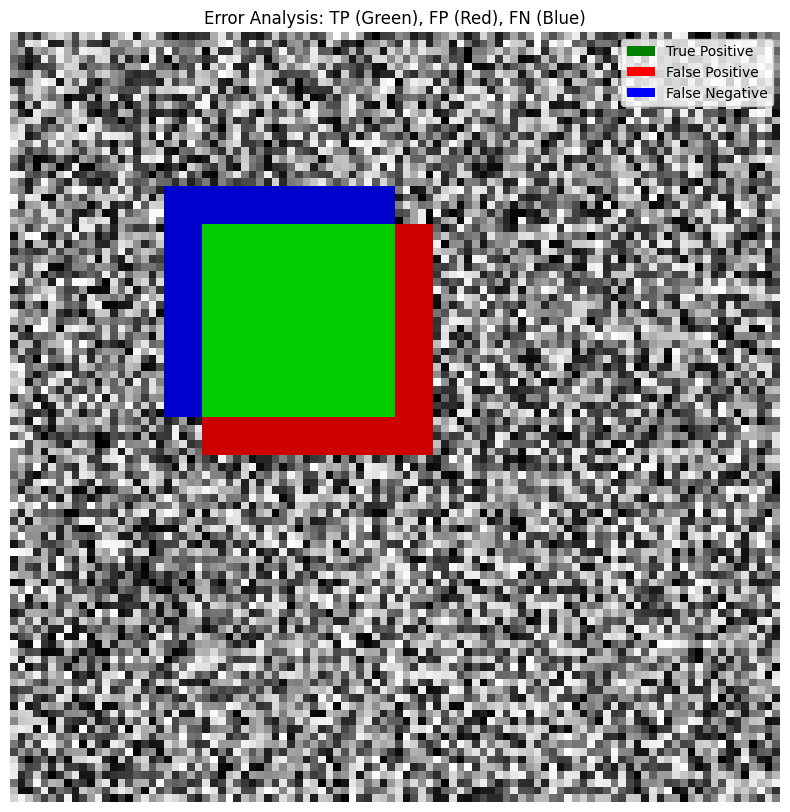
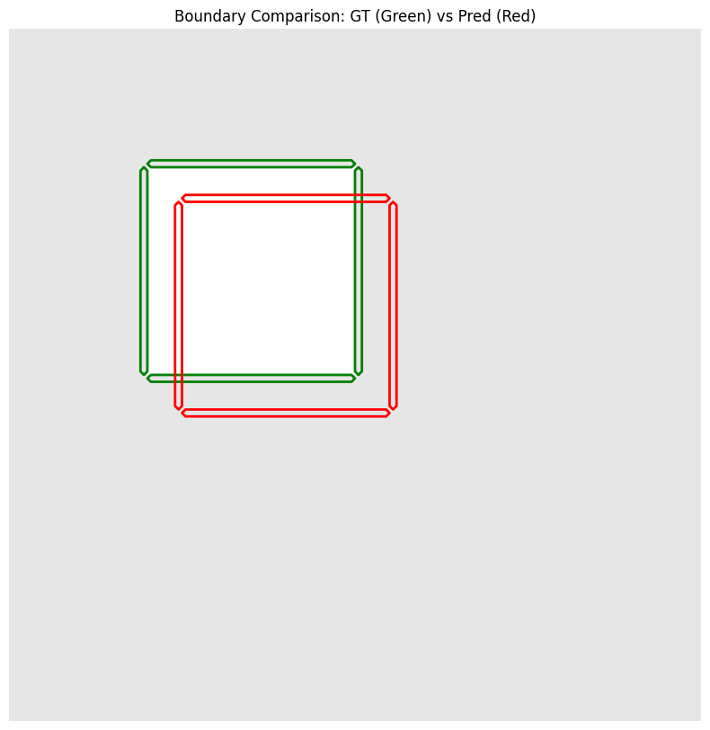
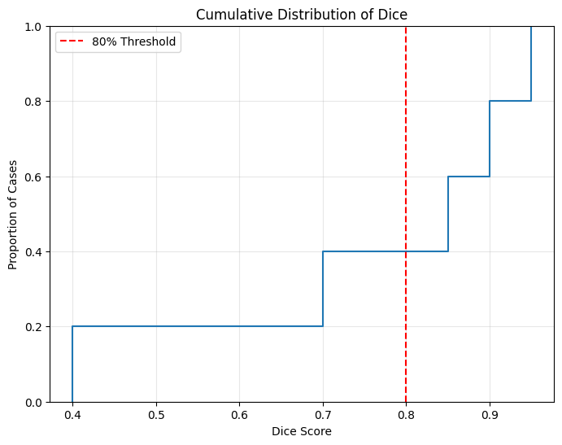
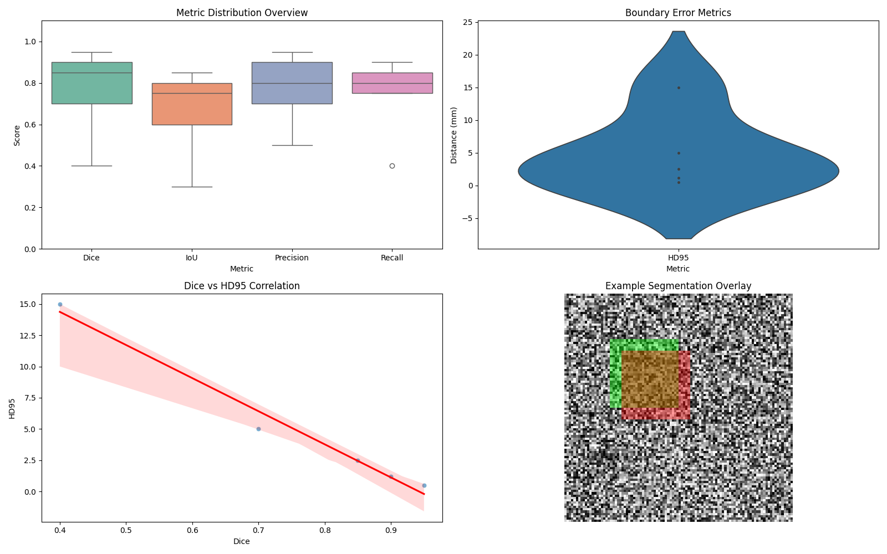
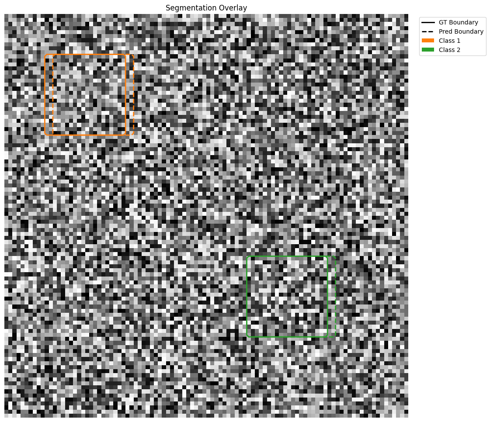
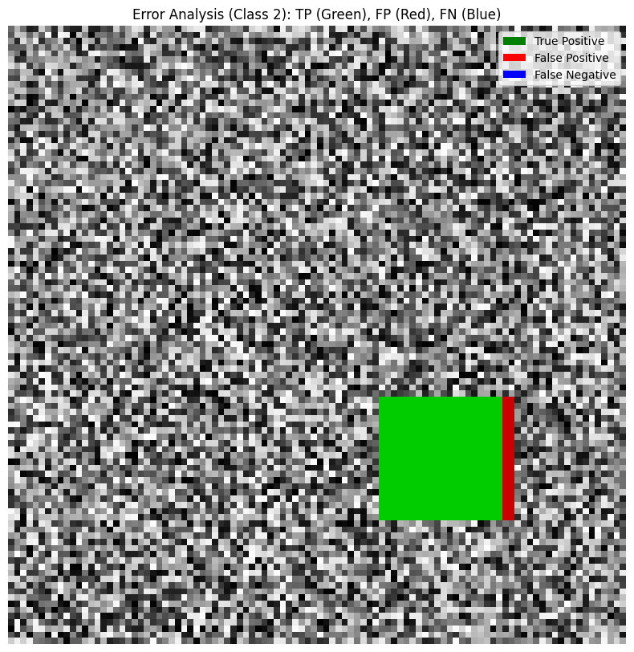

# Monai Ultrasound Working Group (monai_wg)

This package provides a standardized evaluation framework for Ultrasound segmentation models, focusing on industry-standard metrics and advanced research visualizations.

## Table of Contents
- [Installation](#installation)
- [Modules](#modules)
    - [Metrics](#metrics-monai_wgmetrics)
    - [Postprocessing](#postprocessing-monai_wgpostprocessing)
    - [Plotting](#plotting-monai_wgplotting)
- [Usage Examples](#usage-examples)

## Installation
Ensure you have the required dependencies:
```bash
pip install monai matplotlib pandas seaborn scikit-learn scipy torch torchvision
```

## Modules

### Metrics (`monai_wg.metrics`)
The `MonaiMetricWrapper` simplifies the calculation of multiple segmentation metrics at once, handling batch normalization and one-hot conversion internally.

**Supported Metrics:**
- **Dice Score**: Measures spatial overlap.
- **IoU (Intersection over Union)**: Jaccard index for region similarity.
- **HD95 (Hausdorff Distance 95th Percentile)**: Robust measure of boundary distance.
- **ASD (Average Surface Distance)**: Mean distance between surface points.
- **Precision & Recall**: Pixel-wise classification performance.

### Postprocessing (`monai_wg.postprocessing`)
A flexible pipeline to transform raw model outputs into clean binary/multi-class masks.
- **Activation**: Supports `sigmoid` and `softmax`.
- **Discretization**: Supports `threshold` and `argmax`.
- **Cleanup**: Morphological cleanup using `KeepLargestConnectedComponent`.

### Plotting (`monai_wg.plotting`)
Comprehensive visualization tools tailored for medical imaging research.

| Function | Description |
|----------|-------------|
| `plot_segmentation` | Simple overlay of GT (Green) and Pred (Red). |
| `plot_segmentation_error_heatmap` | Visualizes TP (Green), FP (Red), and FN (Blue). |
| `plot_boundary_comparison` | Focuses on contour alignment (GT vs Pred). |
| `plot_radar_chart` | Multi-metric profile comparison for different models. |
| `plot_dice_cdf` | Cumulative distribution for performance reliability. |
| `plot_pixel_confusion_matrix` | Normalized heatmap of pixel classification. |
| `plot_metric_distribution` | Violin plots for dataset-wide metric spread. |
| `plot_metric_correlation` | Scatter plots (e.g., Dice vs HD95) with regression. |
| `plot_performance_vs_size` | Analyzes performance as a function of object size. |
| `plot_summary_report` | Grid layout of metrics, distributions, and sample overlays. |

## Research Visualizations
The package implements the most common plots used in medical segmentation research.

### Error Analysis & Boundaries
Comparing Ground Truth and Prediction boundaries and identifying types of errors (TP, FP, FN).

| Error Heatmap | Boundary Comparison |
|:---:|:---:|
|  |  |

### Performance Distribution & Profiles
Visualizing model profiles across multiple metrics and performance reliability.

| Radar Chart Comparison | Dice CDF Profile |
|:---:|:---:|
|  |  |

### Comprehensive Summary
A unified grid view providing a high-level overview of model performance.



## Multi-label & Multi-class Support
The package is designed for complex medical imaging tasks involving multiple organs or pathologies.

- **Metrics**: `MonaiMetricWrapper` accepts one-hot or index tensors and calculates metrics across all foreground classes. For multi-label (overlapping), ensure your activation is "sigmoid".
- **Plotting**: `plot_segmentation` automatically detects multiple classes and uses distinct color contours to visualize overlaps and boundaries. `plot_segmentation_error_heatmap` allows per-class error analysis using the `class_index` argument.

| Multi-class Overlay | Class-specific Error Analysis |
|:---:|:---:|
|  |  |

## Usage Examples

### 1. Basic Metrics Calculation
```python
from monai_wg.metrics import MonaiMetricWrapper

# Initialize
wrapper = MonaiMetricWrapper(num_classes=2, include_background=False)

# Update with prediction and ground truth (B, C, H, W)
wrapper.update(y_pred, y_true)

# Compute Results
results = wrapper.compute()
print(f"Dice: {results['Dice']:.4f}")
```

### 2. Postprocessing Pipeline
```python
from monai_wg.postprocessing import PostProcessingPipeline

pipeline = PostProcessingPipeline(
    target_spatial_size=(256, 256),
    activation="sigmoid",
    discretization="threshold",
    cleanup=True
)

clean_pred = pipeline(raw_logits)
```

### 3. Advanced Visualization
```python
from monai_wg.plotting import plot_radar_chart
import pandas as pd

df = pd.DataFrame([
    {'Model': 'UNet', 'Dice': 0.82, 'IoU': 0.75, 'Precision': 0.85, 'Recall': 0.80},
    {'Model': 'SAM', 'Dice': 0.88, 'IoU': 0.80, 'Precision': 0.90, 'Recall': 0.86}
])

plot_radar_chart(df, save_path="radar_comparison.png")
```

## Detailed Function Examples

### 1. Metrics & Postprocessing
```python
import torch
from monai_wg import MonaiMetricWrapper, get_standard_postprocessing

# Setup postprocessing
post_proc = get_standard_postprocessing(target_size=(256, 256))

# Initialize metric wrapper
metric_wrapper = MonaiMetricWrapper(num_classes=2)

# Simulate data
y_logits = torch.randn(4, 2, 256, 256)
y_true = torch.randint(0, 2, (4, 1, 256, 256))

# Process and Update
y_pred = post_proc(y_logits)
metric_wrapper.update(y_pred, y_true)

# Get results
df_results = metric_wrapper.get_results_df()
print(df_results)
```

### 2. Basic Segmentation Overlays
```python
from monai_wg import plot_segmentation, plot_segmentation_error_heatmap, plot_boundary_comparison

# Simple GT (Green) vs Pred (Red) overlay
plot_segmentation(image, label, pred, title="Model Overlay")

# Systematic error analysis (TP: Green, FP: Red, FN: Blue)
plot_segmentation_error_heatmap(image, label, pred, class_index=1)

# Boundary contour comparison
plot_boundary_comparison(label, pred)
```

### 3. Dataset-wide Distributions
```python
from monai_wg import plot_metric_distribution, plot_metric_correlation, plot_dice_cdf

# Violin plots for metric spread
plot_metric_distribution(metrics_df, metric_names=['Dice', 'IoU', 'HD95'])

# Correlation between metrics
plot_metric_correlation(metrics_df, x_metric='Dice', y_metric='HD95')

# Reliability profile (CDF)
plot_dice_cdf(metrics_df, metric_name='Dice')
```

### 4. Model Benchmarking & Reports
```python
from monai_wg import plot_radar_chart, plot_model_comparison, plot_summary_report

# Multi-metric profile (Spider chart)
plot_radar_chart(comparison_df, metrics=['Dice', 'IoU', 'Precision', 'Recall'])

# Grouped bar chart comparison
plot_model_comparison(comparison_df, metrics=['Dice', 'HD95'])

# Complete automated research report
plot_summary_report(metrics_df, overlay_info={'image': img, 'label': gt, 'pred': seg})
```

### 5. Advanced Analysis
```python
from monai_wg import plot_pixel_confusion_matrix, plot_performance_vs_size, plot_training_history

# Pixel-wise confusion matrix heatmap
plot_pixel_confusion_matrix(y_true, y_pred)

# Performance vs Object Size analysis
plot_performance_vs_size(metrics_df)

# Training vs Validation curves
plot_training_history(history_df, metrics=['Loss', 'Dice'])
```

---
*Developed for the Monai Ultrasound Working Group. - Tejas Haritsa V K*